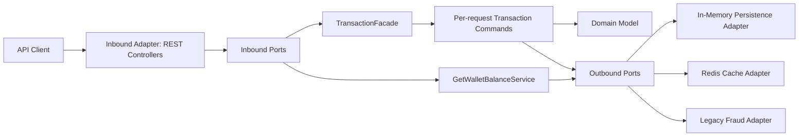

# Architecture

FinTechTransactionService uses a compact hexagonal architecture.



## Boundary Rules

- `domain` contains pure business concepts and does not depend on Spring.
- `application` contains use cases, ports, strategies, factories, and commands.
- `adapter` contains REST, Redis, fraud, and persistence implementations.
- `infrastructure` contains technical Spring configuration.

These rules are checked by `HexagonalArchitectureTest`.

## Persistence Choice

The MVP uses in-memory repository adapters. This keeps the capstone self-contained while preserving the repository port boundary. A JPA or PostgreSQL adapter could replace the in-memory adapter without changing domain or application code.

## Cache-Aside

`GetWalletBalanceService` owns cache-aside behavior:

1. Check Redis through `BalanceCachePort`.
2. Return cached balance on hit.
3. Load wallet from repository on miss.
4. Write balance to Redis.
5. Return balance.

Deposit and transfer commands evict affected wallet balances after money movement.

## Circuit Breaker

`LegacyFraudRiskAdapter` wraps `LegacyFraudRiskClient` with Resilience4j. The demo trigger is:

```text
FAIL_FRAUD
```

When this text appears in a transfer description, the legacy provider throws and the adapter falls back to `REVIEW_REQUIRED`.

